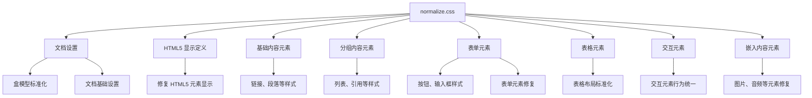

# normalize.css 详解：CSS 样式标准化最佳实践

## 库基本信息

- **库名称**：normalize.css
- **库类型**：CSS 重置与标准化工具库
- **开源状态**：开源，使用 MIT 许可证
- **主要维护者**：Nicolas Gallagher 和 Jonathan Neal
- **版本信息**：当前最新稳定版本 8.0.1，更新频率较低但稳定
- **官方链接**：
  - GitHub 仓库：[necolas/normalize.css](https://github.com/necolas/normalize.css)
  - npm 包：[normalize.css](https://www.npmjs.com/package/normalize.css)
- **浏览器兼容性**：支持所有现代浏览器以及 IE 8+
- **对应概念**：移动端开发中，类似的库有 Android 的 Material Components 标准样式和 iOS 的 UIKit 默认样式

## 库详细解析

### 概述

#### 核心功能

normalize.css 是一个小型的 CSS 文件，旨在标准化不同浏览器之间的默认样式差异，使 HTML 元素在所有浏览器中呈现一致的基础样式。与传统的 CSS 重置（如 Eric Meyer's Reset CSS）不同，normalize.css 保留了有用的浏览器默认样式，而不是将所有样式重置为零。

#### 设计理念

normalize.css 的设计理念基于以下几点：

- **保留有用的默认值**：不同于完全重置所有样式，normalize.css 保留了许多有用的默认样式
- **标准化样式**：使元素在跨浏览器环境中具有一致的外观和行为
- **修复 bug**：修复常见的浏览器 bug 和不一致性
- **提高可用性**：通过细微的改进提高元素的可用性
- **使用详细的注释**：解释代码的作用和原因
- **模块化**：根据项目需求可以轻松定制和扩展

#### 技术特点

1. **轻量级**：文件大小约 8KB（未压缩），对项目性能影响极小
2. **针对性修复**：针对特定浏览器的已知问题提供精确修复
3. **现代化方法**：采用现代 CSS 实践，而非传统的激进式重置
4. **高度可维护**：代码结构清晰，注释详尽，易于理解和修改
5. **HTML5 元素支持**：为 HTML5 元素提供基础样式和显示设置

#### 优缺点

**优势：**

- 保留有用的浏览器默认样式，减少了自定义 CSS 的工作量
- 修复了各种浏览器 bug 和不一致性，提高了跨浏览器兼容性
- 模块化设计，易于与其他 CSS 框架集成
- 文件小巧，不会明显增加项目的加载时间
- 广泛的浏览器支持，包括老版本的 IE 浏览器

**局限性：**

- 不是完全的视觉重置，如果需要更彻底的重置可能需要额外配置
- 对于特定项目可能需要进一步定制
- 解决的问题集中在元素的默认样式上，不涉及布局和复杂组件

#### 与其他库对比

| 特性 | normalize.css | CSS Reset | sanitize.css | ress |
|------|--------------|-----------|--------------|------|
| 文件大小 | ~8KB | ~2KB | ~10KB | ~14KB |
| 方法 | 标准化 | 全部重置 | 标准化+净化 | 标准化+重置 |
| 保留默认样式 | 是 | 否 | 部分 | 部分 |
| 修复浏览器 bug | 是 | 否 | 是 | 是 |
| HTML5 支持 | 完整 | 有限 | 完整 | 完整 |
| 定制性 | 中等 | 高 | 中等 | 中等 |
| 维护状态 | 活跃 | 较少更新 | 活跃 | 活跃 |

#### 适用场景

normalize.css 最适合以下场景：

- 需要在各种浏览器中保持一致基础样式的前端项目
- 作为 CSS/UI 框架的基础层使用
- 希望在现有浏览器默认样式基础上进行开发，而非完全重置
- 需要处理老旧浏览器兼容性问题的项目
- 偏好渐进增强而非彻底重构默认样式的开发方法

### 架构设计

#### 整体架构

normalize.css 采用模块化结构，按照 HTML 元素类型和功能划分为不同部分：



#### 核心组件

normalize.css 没有传统意义上的组件划分，但可以按功能模块划分为以下核心部分：

1. **文档设置**：设置基础的盒模型和文档属性
2. **HTML5 元素显示**：确保 HTML5 新元素在旧浏览器中正确显示
3. **基础文本样式**：标准化文本相关元素（如标题、段落、链接）
4. **列表样式**：统一列表元素的外观
5. **嵌入内容**：修复嵌入内容（如图像、音频、视频）的问题
6. **表单元素**：标准化表单元素的行为和外观
7. **表格元素**：统一表格的默认样式
8. **浏览器特定修复**：针对特定浏览器的问题提供修复

#### 设计模式

normalize.css 使用的主要设计模式包括：

- **渐进增强**：从基础标准化开始，允许在此基础上进行定制和扩展
- **模块化组织**：按照 HTML 元素类型和功能组织代码
- **最小干预原则**：只进行必要的样式修改，不过度重置

#### 依赖关系

normalize.css 是一个独立的 CSS 库，不依赖任何外部资源或框架。它被设计为可以：

- 作为独立样式表使用
- 集成到现有 CSS 架构中
- 作为其他 CSS 框架的基础
- 与预处理器（如 Sass、Less）一起使用

#### 扩展性

normalize.css 提供了良好的扩展性：

- 可以通过添加自定义 CSS 规则来覆盖或扩展其功能
- 可以根据项目需求移除不需要的部分
- 可以结合预处理器变量系统进行主题定制
- 可以作为 CSS 模块化架构（如 BEM、SMACSS）的基础层

### 主要组件解析

#### 文档设置与盒模型

**核心功能**：标准化 HTML 文档的基本属性和盒模型行为

**重要代码**：

```css
html {
  line-height: 1.15; /* 1 */
  -webkit-text-size-adjust: 100%; /* 2 */
}

body {
  margin: 0;
}

* {
  box-sizing: border-box;
}
```

**设计理念**：

- 确保所有浏览器使用一致的行高和文本缩放行为
- 移除 body 默认边距以提供统一的起点
- 提供一致的盒模型（在某些版本中）

#### HTML5 元素显示定义

**核心功能**：确保 HTML5 新元素在旧浏览器中正确显示

**重要代码**：

```css
article,
aside,
footer,
header,
nav,
section {
  display: block;
}

audio,
canvas,
video {
  display: inline-block;
}
```

**设计理念**：使 HTML5 语义元素在所有浏览器中具有正确的默认显示属性

#### 排版与文本元素

**核心功能**：标准化文本相关元素的样式

**重要代码**：

```css
h1 {
  font-size: 2em;
  margin: 0.67em 0;
}

abbr[title] {
  border-bottom: none; /* 1 */
  text-decoration: underline; /* 2 */
  text-decoration: underline dotted; /* 2 */
}

b,
strong {
  font-weight: bolder;
}
```

**设计理念**：

- 保持有意义的默认文本样式（如标题大小）
- 修复常见文本元素的浏览器不一致性
- 提高文本可读性和可访问性

#### 链接与交互元素

**核心功能**：标准化链接和交互元素的行为

**重要代码**：

```css
a {
  background-color: transparent;
}

a:active,
a:hover {
  outline-width: 0;
}
```

**设计理念**：

- 移除不一致的背景色
- 修复焦点和悬停状态的外观
- 确保交互元素在所有浏览器中有一致的行为

#### 表单元素

**核心功能**：标准化表单元素的外观和行为

**重要代码**：

```css
button,
input,
optgroup,
select,
textarea {
  font-family: inherit; /* 1 */
  font-size: 100%; /* 1 */
  line-height: 1.15; /* 1 */
  margin: 0; /* 2 */
}

button,
input { /* 1 */
  overflow: visible;
}

button,
select { /* 1 */
  text-transform: none;
}
```

**设计理念**：

- 使表单元素继承字体属性
- 标准化表单元素的大小和边距
- 修复各种浏览器特定的表单元素问题

#### 嵌入内容

**核心功能**：修复嵌入内容（如图像、音频、视频）的问题

**重要代码**：

```css
img {
  border-style: none;
}

svg:not(:root) {
  overflow: hidden;
}
```

**设计理念**：

- 移除图像的默认边框
- 修复 SVG 溢出问题
- 确保嵌入内容有一致的表现方式

#### 表格元素

**核心功能**：标准化表格元素的样式

**重要代码**：

```css
table {
  border-collapse: collapse;
  border-spacing: 0;
}
```

**设计理念**：

- 提供一致的表格布局算法
- 标准化表格边框和间距行为

### 集成与配置

#### 依赖引入

**npm/yarn 安装**：

```bash
# 使用 npm
npm install normalize.css

# 使用 yarn
yarn add normalize.css
```

**CDN 引入**：

```html
<link rel="stylesheet" href="https://cdnjs.cloudflare.com/ajax/libs/normalize/8.0.1/normalize.min.css">
```

**直接下载**：

从 GitHub 仓库下载最新版本并在 HTML 中引用：

```html
<link rel="stylesheet" href="path/to/normalize.css">
```

#### 与构建工具集成

**在 Webpack 中使用**：

```javascript
// 在入口文件中导入
import 'normalize.css';
```

**在 Vite 中使用**：

```javascript
// 在 main.js 中导入
import 'normalize.css';
```

**在 CSS 预处理器中使用**：

```scss
// Sass 中导入
@import '~normalize.css/normalize.css';

// 然后添加自定义样式
body {
  background-color: #f5f5f5;
}
```

#### 与 CSS 框架集成

**与 Bootstrap 集成**：

```scss
// 在 Bootstrap 自定义文件中
@import '~normalize.css/normalize.css';
@import '~bootstrap/scss/bootstrap';
```

**与 Tailwind CSS 集成**：

```js
// tailwind.config.js
module.exports = {
  corePlugins: {
    preflight: false, // 禁用 Tailwind 的预设样式
  },
  // 其他配置...
}
```

```css
/* 在主 CSS 文件中 */
@import 'normalize.css';
@import 'tailwindcss/components';
@import 'tailwindcss/utilities';
```

### 使用教程

#### 基础用法

**环境准备**：

确保你的项目已经设置好基本的 HTML 结构和 CSS 引用路径。

**基本示例**：

```html
<!DOCTYPE html>
<html lang="zh-CN">
<head>
  <meta charset="UTF-8">
  <meta name="viewport" content="width=device-width, initial-scale=1.0">
  <title>normalize.css 示例</title>
  <link rel="stylesheet" href="normalize.css">
  <link rel="stylesheet" href="your-styles.css">
</head>
<body>
  <h1>标题示例</h1>
  <p>这是一个段落。normalize.css 确保这个段落在各种浏览器中都有一致的外观。</p>
  
  <ul>
    <li>列表项 1</li>
    <li>列表项 2</li>
    <li>列表项 3</li>
  </ul>
  
  <form>
    <label for="name">姓名：</label>
    <input type="text" id="name" name="name">
    <button type="submit">提交</button>
  </form>
</body>
</html>
```

**关键步骤**：

1. 将 normalize.css 作为第一个样式表引入
2. 然后引入你自己的样式表，以便覆盖 normalize 的设置
3. 按照正常方式编写 HTML 和 CSS

#### 进阶用法

**定制 normalize.css**：

可以通过注释或删除不需要的部分来定制 normalize.css：

```css
/* 只保留需要的部分 */
/* 文档设置 */
html {
  line-height: 1.15;
  -webkit-text-size-adjust: 100%;
}

body {
  margin: 0;
}

/* 你可以注释掉不需要的部分，如表单相关的标准化 */
/*
button,
input {
  overflow: visible;
}
*/
```

**与 CSS 变量结合**：

```css
:root {
  --base-font-size: 16px;
  --base-line-height: 1.5;
  --base-font-family: -apple-system, BlinkMacSystemFont, "Segoe UI", Roboto, Oxygen-Sans, Ubuntu, Cantarell, "Helvetica Neue", sans-serif;
}

/* 在 normalize.css 后应用 */
html {
  font-size: var(--base-font-size);
  line-height: var(--base-line-height);
  font-family: var(--base-font-family);
}
```

#### 最佳实践

**推荐使用顺序**：

1. 首先加载 normalize.css
2. 然后是全局变量和设置
3. 接着是基础样式
4. 最后是组件样式和工具类

**避免冲突的方法**：

- 不要直接修改 normalize.css 文件，而是在你自己的 CSS 中覆盖它
- 使用更高特异性选择器来覆盖 normalize.css 的设置
- 考虑使用 CSS 预处理器的导入和扩展功能

**维护技巧**：

- 保持 normalize.css 的更新，但每次更新前检查变更日志
- 在升级前进行浏览器兼容性测试
- 记录你对 normalize.css 所做的任何修改

### 源码分析

#### 代码结构

normalize.css 源代码结构简洁明了，按照 HTML 元素类型组织，每个部分都有详细的注释说明代码的目的和作用：

```css
/* Document
   ========================================================================== */

/**
 * 1. 修正所有浏览器的行高。
 * 2. 阻止 iOS 在方向改变后调整字体大小。
 */

html {
  line-height: 1.15; /* 1 */
  -webkit-text-size-adjust: 100%; /* 2 */
}

/* 更多代码... */
```

#### 核心实现原理

normalize.css 的核心实现基于以下原则：

1. **选择性重置**：只重置有问题的元素样式，而非全部重置
2. **特定浏览器修复**：针对特定浏览器的已知问题提供精确修复
3. **最小干预**：仅做必要的修改，保持默认行为的一致性
4. **详细注释**：解释每个修复的目的和原因

#### 值得学习的设计思想

1. **渐进增强**：基于现有默认样式进行改进，而非完全重写
2. **兼容性思维**：在保持现代浏览器体验的同时兼顾旧浏览器
3. **模块化组织**：按功能和元素类型组织代码，使结构清晰
4. **详细文档**：使用注释解释每个规则的目的，便于维护和学习

### 性能与安全考虑

#### 性能指标

- 文件大小：未压缩约 8KB，压缩后约 2KB
- 加载时间：作为关键 CSS 时影响首次渲染时间极小
- 渲染性能：由于只包含基础样式，对渲染性能几乎没有负面影响

#### 性能优化建议

1. 使用压缩版本以减少文件大小
2. 考虑将 normalize.css 内联到关键 CSS 中，减少请求
3. 移除不需要的部分以进一步减小文件大小
4. 利用浏览器缓存减少重复下载

#### 安全注意事项

normalize.css 本身不存在安全风险，因为它只包含基础样式规范化代码，不涉及脚本执行或资源加载。

### 版本兼容性与迁移

#### 版本历史

normalize.css 的主要版本发展：

- **v1.0**：初始版本，发布于 2012 年
- **v2.0**：改进了 HTML5 元素的支持
- **v3.0**：加强了表单元素的标准化
- **v4.0**：改进了一致性和可访问性
- **v5.0**：专注于 IE 8+ 和现代浏览器
- **v7.0**：更新了对最新浏览器版本的支持
- **v8.0**：目前的稳定版本，进一步改进和优化

#### 浏览器兼容性

normalize.css 当前版本支持以下浏览器：

- Chrome（最新版）
- Edge（最新版）
- Firefox（最新版）
- Safari（最新版）
- Opera（最新版）
- IE 8+（旧版本提供更好的支持）

#### 从旧版本迁移

从旧版本迁移到最新版本的建议：

1. 查看变更日志了解主要变化
2. 检查已被移除的修复或已添加的新功能
3. 测试关键页面在不同浏览器中的表现
4. 根据需要更新自定义样式以适应新版本

### 常见问题与解决方案

#### 常见问题

**问题 1：normalize.css 与项目中的其他 CSS 框架冲突**

解决方案：

- 确保 normalize.css 作为第一个样式表加载
- 检查冲突的具体规则，必要时在自定义样式中使用更高特异性选择器覆盖

**问题 2：升级 normalize.css 后页面样式发生变化**

解决方案：

- 查看变更日志了解修改内容
- 针对关键元素编写特定的 CSS 规则以保持一致外观

**问题 3：某些浏览器仍然显示不一致**

解决方案：

- 为特定浏览器添加额外的 CSS 修复
- 使用特性检测或媒体查询针对问题浏览器提供特定样式

#### 调试技巧

- 使用浏览器开发者工具检查元素样式的应用顺序
- 在开发工具中禁用/启用 normalize.css 以观察其影响
- 使用 CSS 验证工具检查样式表的有效性和潜在问题

### 相关库与工具

#### 替代方案

1. **reset.css**：更激进的重置，完全清除浏览器默认样式
2. **sanitize.css**：基于 normalize.css 的扩展，增加了更多的标准化规则
3. **modern-normalize**：专注于现代浏览器的简化版 normalize.css
4. **ress**：结合了 normalize.css 和 reset.css 的特性

#### 互补工具

1. **Autoprefixer**：自动添加浏览器前缀，配合 normalize.css 增强兼容性
2. **Stylelint**：CSS 检查工具，确保样式质量
3. **PurgeCSS**：移除未使用的 CSS，可以精简最终的 CSS 文件

### 学习资源与社区

#### 官方资源

- [GitHub 仓库](https://github.com/necolas/normalize.css)：包含源码、文档和问题跟踪
- [npm 包页面](https://www.npmjs.com/package/normalize.css)：提供安装和使用信息

#### 社区资源

- [CSS-Tricks 关于 normalize.css 的文章](https://css-tricks.com/normalize-css/)
- [MDN Web Docs CSS 指南](https://developer.mozilla.org/zh-CN/docs/Web/CSS)
- [StackOverflow normalize.css 相关问题](https://stackoverflow.com/questions/tagged/normalize.css)

#### 延伸阅读

- [浏览器默认样式对比工具](https://browserdefaultstyles.com/)
- [现代 CSS 重置的方法与实践](https://piccalil.li/blog/a-modern-css-reset/)
- [CSS Zen Garden](http://www.csszengarden.com/)：展示 CSS 设计可能性的经典网站

## 总结

normalize.css 是一个轻量级但功能强大的 CSS 工具库，它通过标准化不同浏览器的默认样式，为开发者提供了一致的起点。与完全重置所有样式的传统方法不同，normalize.css 保留了有用的默认样式，修复了浏览器间的差异和 bug，并提供了对 HTML5 元素的良好支持。

它的模块化设计和详细注释使其易于理解和定制，而小文件体积使其成为几乎所有前端项目的理想选择。无论是用于简单网站还是复杂的 Web 应用，normalize.css 都能帮助开发者减少处理跨浏览器兼容性问题的时间，专注于构建独特的用户体验。

在前端开发不断发展的今天，normalize.css 仍然是标准化 CSS 的首选解决方案，是构建现代、一致和可靠 Web 界面的坚实基础。
