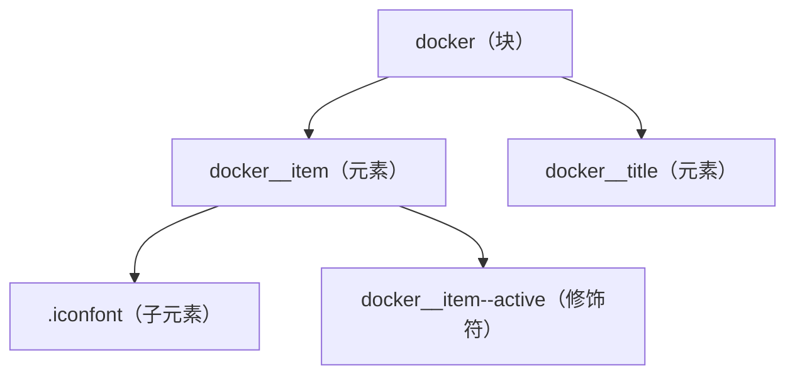

# Sass 代码块分析

## 代码逐行解析

```scss
<style lang="scss">
.docker {
  display: flex;
  box-sizing: border-box;
  position: absolute;
  padding: 0 .18rem;
  left: 0;
  bottom: 0;
  width: 100%;
  height: .49rem;
  border-top: 1px solid #F1F1F1;
  &__item {
    flex: 1;
    text-align: center;
    .iconfont {
      margin: .07rem 0 .02rem 0;
      font-size: .18rem;
    }
    &--active {
      color: #1FA4FC;
    }
  }
  &__title {
    font-size: 20px;
    transform: scale(.5, .5);
    transform-origin: center top;
  }
}
</style>
```

这段 Sass 代码定义了一个移动端底部导航栏（通常称为 Docker 或 Tabbar）的样式：

1. `<style lang="scss">` - 声明使用 SCSS 语法编写样式。
2. `.docker` - 定义主容器类选择器，作为底部导航栏的容器。
3. `display: flex` - 使用弹性布局，让子元素在水平方向均匀分布。
4. `box-sizing: border-box` - 设置盒模型为边框盒，使元素的宽高包含内边距和边框。
5. `position: absolute` - 使用绝对定位，将导航栏固定在屏幕底部。
6. `padding: 0 .18rem` - 设置水平内边距为 0.18rem，垂直内边距为 0。
7. `left: 0; bottom: 0` - 将导航栏定位在左下角。
8. `width: 100%` - 宽度占据整个屏幕。
9. `height: .49rem` - 高度设为 0.49rem。
10. `border-top: 1px solid #F1F1F1` - 顶部添加一条淡灰色边框用于视觉分隔。
11. `&__item` - 使用 BEM 命名方法的嵌套选择器，表示导航项。
12. `flex: 1` - 让每个导航项平均分配剩余空间。
13. `text-align: center` - 文本居中对齐。
14. `.iconfont` - 嵌套选择器，定义图标样式。
15. `margin: .07rem 0 .02rem 0` - 设置图标的边距，上下有间距。
16. `font-size: .18rem` - 设置图标字体大小。
17. `&--active` - BEM 修饰符，定义激活状态的导航项样式。
18. `color: #1FA4FC` - 设置激活状态的颜色为蓝色。
19. `&__title` - 另一个 BEM 元素，表示导航项的标题文本。
20. `font-size: 20px` - 设置文本字体大小为 20px。
21. `transform: scale(.5, .5)` - 使用缩放变换将文本缩小至原来的 50%。
22. `transform-origin: center top` - 设置变换的原点在顶部中央。

## 样式结构分析

代码使用了 BEM（Block-Element-Modifier）命名方法来组织 CSS 类名，提供了清晰的层次结构：



这种结构体现了以下设计思想：

1. **容器与项目分离**：`.docker` 作为容器控制整体布局，而 `.docker__item` 控制每个导航项的样式。
2. **状态样式隔离**：使用 `&--active` 修饰符专门处理激活状态。
3. **组件化思想**：每个部分负责自己的职责，形成自包含的组件。

## Sass 语法特性

代码中使用了以下 Sass 特性：

1. **嵌套选择器**：使用嵌套语法减少重复编写父选择器的名称，如 `.docker` 内嵌套了 `&__item` 和 `&__title`。
2. **父选择器引用（&）**：使用 `&` 符号引用父选择器，用于创建 BEM 风格的选择器，如 `&__item` 编译后变成 `.docker__item`。
3. **修饰符语法**：使用 `&--active` 创建修饰符类，表示元素的特殊状态。

这些特性使得代码结构更清晰、更易维护，减少了冗余选择器的书写。

## CSS 生成分析

这段 Sass 代码编译后会生成如下 CSS：

```css
.docker {
  display: flex;
  box-sizing: border-box;
  position: absolute;
  padding: 0 0.18rem;
  left: 0;
  bottom: 0;
  width: 100%;
  height: 0.49rem;
  border-top: 1px solid #F1F1F1;
}
.docker__item {
  flex: 1;
  text-align: center;
}
.docker__item .iconfont {
  margin: 0.07rem 0 0.02rem 0;
  font-size: 0.18rem;
}
.docker__item--active {
  color: #1FA4FC;
}
.docker__title {
  font-size: 20px;
  transform: scale(0.5, 0.5);
  transform-origin: center top;
}
```

这种生成方式的特点是：

1. 选择器结构清晰，遵循 BEM 命名规范。
2. 没有过深的选择器嵌套，避免了特异性过高问题。
3. 类名语义明确，便于维护和调试。

## 最佳实践与改进建议

### 符合最佳实践的部分

1. **BEM 命名规范**：使用 BEM 命名方法提高了代码的可读性和可维护性。
2. **弹性布局**：使用 `flex` 布局实现了均匀分布的导航项。
3. **语义化命名**：类名具有良好的语义，如 `.docker`、`.docker__item` 等。

### 改进建议

1. **变量使用**：可以引入 Sass 变量来管理颜色和尺寸，例如：

```scss
$docker-height: 0.49rem;
$docker-padding: 0 0.18rem;
$active-color: #1FA4FC;
$border-color: #F1F1F1;
```

2. **单位一致性**：混合使用了 `rem` 和 `px`，建议统一使用 `rem` 或其他响应式单位。

```scss
&__title {
  font-size: 0.2rem; // 替代 20px
  transform: scale(0.5, 0.5);
  transform-origin: center top;
}
```

3. **避免硬编码转换**：直接设置更小的字体大小，而不是用 `transform: scale()` 缩小，可能会有更好的渲染效果：

```scss
&__title {
  font-size: 0.1rem; // 直接设置为需要的大小
}
```

4. **添加响应式设计**：可以考虑增加媒体查询，以适应不同屏幕尺寸：

```scss
@media screen and (min-width: 768px) {
  .docker {
    height: 0.6rem;
    
    &__title {
      font-size: 0.12rem;
    }
  }
}
```

## 补充说明

这段代码实现了一个典型的移动端应用底部导航栏，使用了 rem 单位，这通常与移动端适配方案（如 flexible.js）配合使用，实现等比例缩放。`.iconfont` 类暗示使用了字体图标实现图标部分，这是移动端常用的图标解决方案，相比于图片有更好的缩放性能。

导航标题文字的处理方式（使用 `transform: scale(0.5, 0.5)`）是一种在不改变元素原始空间大小的情况下缩小文字的技巧，但这种方法可能在某些浏览器中导致文字模糊，建议直接使用更小的字体大小。

### 相关资源

- [Sass 官方文档](https://sass-lang.com/documentation/)
- [BEM 命名规范](http://getbem.com/)
- [移动端适配方案](https://github.com/amfe/lib-flexible)
